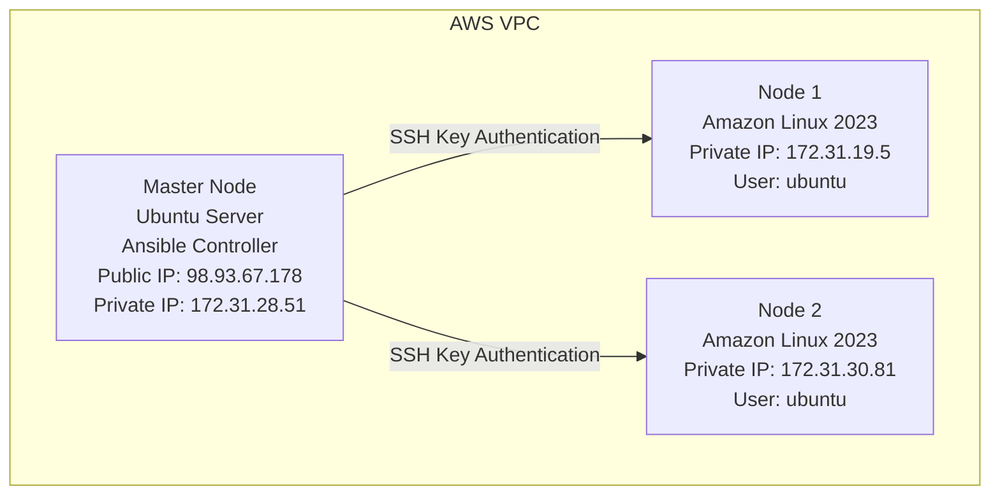
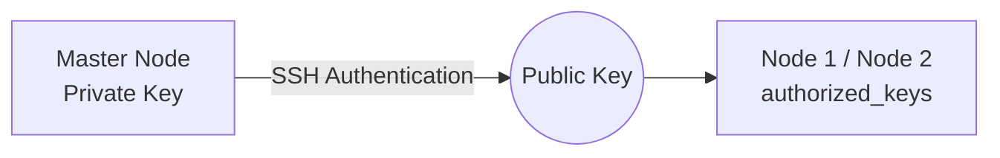

# CloudForge: Multi-Node Infrastructure Automation Using Ansible on AWS

## Phase 1 — Infrastructure and Ansible Setup

This phase focuses on building the AWS infrastructure, configuring secure SSH communication, and preparing Ansible automation between the control node and managed nodes.

## Table of Contents

1. [Project Overview](#1-project-overview)
2. [Project Goal](#2-project-goal)
3. [Architecture Diagram](#3-architecture-diagram)
4. [AWS EC2 Infrastructure](#4-aws-ec2-infrastructure)
5. [Operating System Details](#5-operating-system-details)
6. [Network Design](#6-network-design)
7. [User Configuration](#7-user-configuration)
8. [SSH Passwordless Authentication](#8-ssh-passwordless-authentication)
9. [Sudo Configuration](#9-sudo-configuration)
10. [Ansible Installation](#10-ansible-installation)
11. [Ansible Configuration File](#11-ansible-configuration-file)
12. [Inventory Configuration](#12-inventory-configuration)
13. [Ansible Connectivity Test](#13-ansible-connectivity-test)
14. [Problems Faced and Solutions](#14-problems-faced-and-solutions)
15. [Current Status](#15-current-status)
16. [Next Phase](#16-next-phase)

---

## 1. Project Overview

**CloudForge** is a multi-node infrastructure automation project built on AWS, using **Ansible** to manage configuration across a control node and multiple managed nodes.

This document (Phase 1) covers the foundational work: provisioning EC2 instances, establishing secure passwordless SSH access, and preparing the Ansible control node for automation.

## 2. Project Goal

The goal of this phase is to establish a reliable, secure, and automation-ready infrastructure foundation:

- Provision a Master (control) node and two Managed nodes on AWS EC2
- Establish passwordless SSH authentication between the control node and managed nodes
- Install and configure Ansible on the control node
- Verify connectivity between the control node and managed nodes using Ansible

## 3. Architecture Diagram



## 4. AWS EC2 Infrastructure

| Instance | Role | OS | Public IP | Private IP |
|---|---|---|---|---|
| Master | Ansible Control Node | Ubuntu | 98.93.67.178 | 172.31.28.51 |
| Node 1 | Managed Node | Amazon Linux 2023 | — | 172.31.19.5 |
| Node 2 | Managed Node | Amazon Linux 2023 | — | 172.31.30.81 |

## 5. Operating System Details

| Instance | Operating System | Purpose |
|---|---|---|
| Master | Ubuntu Server | Runs Ansible and orchestrates configuration across managed nodes |
| Node 1 | Amazon Linux 2023 | Managed node, receives configuration via Ansible over SSH |
| Node 2 | Amazon Linux 2023 | Managed node, receives configuration via Ansible over SSH |

## 6. Network Design

All three instances reside within the same **AWS VPC**:

- The **Master node** has both a public IP (`98.93.67.178`) for external SSH access and a private IP (`172.31.28.51`) for internal communication.
- **Node 1** and **Node 2** are only reachable via their private IPs (`172.31.19.5` and `172.31.30.81`), since they don't require direct external access.
- All Ansible traffic between the Master and the managed nodes flows over SSH using the private IP addresses within the VPC.

## 7. User Configuration

A dedicated `ubuntu` user is created on each managed node to run Ansible tasks.

**Create user on node:**

```bash
useradd -m ubuntu
```

## 8. SSH Passwordless Authentication

### Why Passwordless Authentication?

- Ansible communicates with managed nodes through SSH.
- Manual password entry cannot support unattended automation.
- Public/private key authentication enables secure, non-interactive communication.

### Authentication Flow



### Commands Used

**Generate an SSH key pair (on Master):**

```bash
ssh-keygen
```

**View the public key:**

```bash
cat ~/.ssh/id_rsa.pub
```

**Configure the `.ssh` directory on each node:**

```bash
mkdir -p /home/ubuntu/.ssh
nano /home/ubuntu/.ssh/authorized_keys
```

**Set correct ownership and permissions:**

```bash
chown -R ubuntu:ubuntu /home/ubuntu/.ssh
chmod 700 /home/ubuntu/.ssh
chmod 600 /home/ubuntu/.ssh/authorized_keys
```

## 9. Sudo Configuration

The `ubuntu` user is granted administrative privileges via the `wheel` group on each Amazon Linux node.

**Grant sudo access:**

```bash
usermod -aG wheel ubuntu
```

**Verify group membership:**

```bash
groups ubuntu
```

## 10. Ansible Installation

Ansible is installed on the Master node only, since it acts as the control node.

**Verify installation:**

```bash
ansible --version
```

**Output:**

```
ansible [core 2.20.1]
```

## 11. Ansible Configuration File

**File:** `ansible.cfg`

```ini
[defaults]
inventory = inventory
remote_user = ubuntu
host_key_checking = False
```

## 12. Inventory Configuration

**File:** `inventory`

```ini
[nodes]
node1 ansible_host=172.31.19.5 ansible_user=ubuntu
node2 ansible_host=172.31.30.81 ansible_user=ubuntu
```

## 13. Ansible Connectivity Test

**Command:**

```bash
ansible nodes -m ping
```

**Result:**

```
node1 | SUCCESS => pong
node2 | SUCCESS => pong
```

## 14. Problems Faced and Solutions

### Problem 1 — `ansible: command not found`

- **Cause:** The command was executed on a managed Node instead of the Master node.
- **Solution:** Run all Ansible commands only from the Master node.

### Problem 2 — `Permission denied (publickey)`

- **Cause:** The SSH public key was not correctly configured on the target node.
- **Solution:** Verify the contents of `/home/ubuntu/.ssh/authorized_keys` on the node.

### Problem 3 — `cat: /root/.ssh/id_rsa.pub: No such file`

- **Cause:** The key was checked on a Node instead of the Master node.
- **Solution:** Remember that the SSH key pair exists only on the machine that generated it (the Master node).

## 15. Current Status

- [x] AWS EC2 infrastructure provisioned
- [x] SSH passwordless communication configured
- [x] Ansible installed on the Master node
- [x] Inventory file configured
- [x] Ansible ping connectivity test passed

## 16. Next Phase

- [ ] Ansible Ad-hoc Commands
