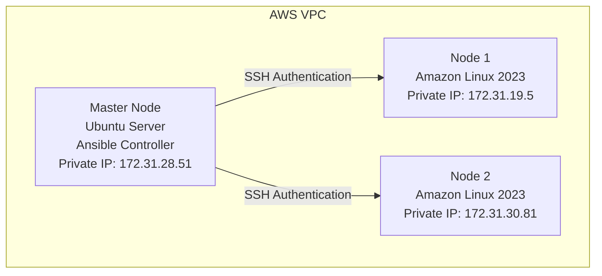

# Ansible Ad-hoc Commands Practice

## Phase 2 — Ansible Command Execution and Server Information Gathering

## Table of Contents

1. [Overview](#1-overview)
2. [Environment](#2-environment)
3. [Command 1 — Check Server Uptime](#3-command-1--check-server-uptime)
4. [Command 2 — Check Hostname](#4-command-2--check-hostname)
5. [Command 3 — Check Disk Usage](#5-command-3--check-disk-usage)
6. [Command 4 — Check Running Processes](#6-command-4--check-running-processes)
7. [Command 5 — Check Network Information](#7-command-5--check-network-information)
8. [Python Interpreter Notice](#8-python-interpreter-notice)
9. [Completed Ad-hoc Commands](#9-completed-ad-hoc-commands)
10. [Next Steps](#10-next-steps)

---

## 1. Overview

After completing the initial AWS infrastructure setup, SSH passwordless authentication, Ansible installation, inventory configuration, and connectivity testing (Phase 1), the next step is practicing **Ansible ad-hoc commands**.

Ad-hoc commands let an administrator execute a one-time command on multiple managed nodes directly from the command line, without writing a playbook — useful for quick checks, diagnostics, and exploration.

## 2. Environment



## 3. Command 1 — Check Server Uptime

**Command:**

```bash
ansible nodes -a "uptime"
```

**Purpose:** Checks how long each managed node has been running. Helps verify server availability, system uptime, and current load average.

**Result:**

```
node2 | CHANGED | rc=0 >>
07:57:40 up 2:30, 3 users, load average: 0.00, 0.00, 0.00

node1 | CHANGED | rc=0 >>
07:57:40 up 2:35, 3 users, load average: 0.00, 0.00, 0.00
```

**Learning:** The Ansible controller successfully executed commands on both managed nodes.

## 4. Command 2 — Check Hostname

**Command:**

```bash
ansible nodes -a "hostname"
```

**Purpose:** Retrieves the hostname of all managed nodes.

**Result:**

```
node2:
ip-172-31-30-81.ec2.internal

node1:
ip-172-31-19-5.ec2.internal
```

**Learning:** AWS automatically assigns internal hostnames based on the private IP address — for example, `172.31.30.81` becomes `ip-172-31-30-81.ec2.internal`.

## 5. Command 3 — Check Disk Usage

**Command:**

```bash
ansible nodes -a "df -h"
```

**Purpose:** Checks available storage on managed nodes — useful before application deployment, database installation, or log configuration.

**Expected information:** filesystem, total disk size, used space, and available space per node.

## 6. Command 4 — Check Running Processes

**Command:**

```bash
ansible nodes -a "ps aux --sort=-%cpu | head"
```

**Purpose:** Checks CPU-consuming processes, useful for identifying high CPU usage, unexpected processes, or resource problems.

### Problem Faced

**Error:**

```
error: garbage option

Usage:
 ps [options]
```

**Cause:** `ps` command options differ between Linux distributions. The `--sort=-%cpu` flag worked on some Linux versions but is not supported in the current Amazon Linux environment.

**Solution:** Use a compatible command instead:

```bash
ansible nodes -a "ps aux | head"
```

or:

```bash
ansible nodes -a "ps -ef | head"
```

**Learning:** Linux commands can behave differently between distributions — always verify command compatibility with the target operating system.

## 7. Command 5 — Check Network Information

**Command:**

```bash
ansible nodes -a "ip addr"
```

**Purpose:** Checks network interfaces and IP addresses of managed nodes — useful for network troubleshooting, IP verification, and interface status checking.

**Result summary:**

| Node | Interface | Private IP |
|---|---|---|
| Node 1 | ens5 | 172.31.19.5 |
| Node 2 | ens5 | 172.31.30.81 |

## 8. Python Interpreter Notice

During command execution, Ansible displayed:

```
Host is using the discovered Python interpreter at:
/usr/bin/python3.9
```

**Explanation:** Ansible modules require Python on managed nodes. Ansible automatically discovered `/usr/bin/python3.9` and used it successfully. This is a warning, not an error.

**Optional configuration** — the interpreter can be pinned explicitly in the inventory file:

```ini
node1 ansible_python_interpreter=/usr/bin/python3.9
node2 ansible_python_interpreter=/usr/bin/python3.9
```

## 9. Completed Ad-hoc Commands

| Command | Purpose |
|---|---|
| `uptime` | Check server uptime |
| `hostname` | Check server hostname |
| `df -h` | Check disk usage |
| `ps` | Check running processes |
| `ip addr` | Check network information |

## 10. Next Steps

- [ ] Memory usage check
- [ ] CPU information
- [ ] Operating system information
- [ ] User verification
- [ ] Package installation
- [ ] Service management
- [ ] File management

After completing ad-hoc command practice, the next phase will be **Ansible Playbooks**.
