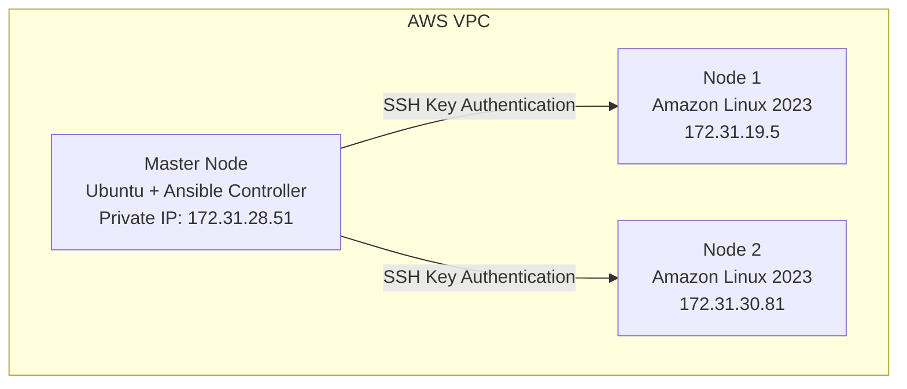

# Ansible Automation Learning Summary

## Project: CloudForge — Multi-Node Infrastructure Automation Using Ansible on AWS

## Overview

This document summarizes the Ansible implementation completed after creating the AWS EC2 infrastructure. The main goal was to configure multiple Linux servers from a single Ansible Control Node and understand a real infrastructure automation workflow — from passwordless access and privilege configuration through to writing and running playbooks.

## Table of Contents

1. [Current Infrastructure](#1-current-infrastructure)
2. [SSH Passwordless Authentication](#2-ssh-passwordless-authentication)
3. [Sudo Configuration](#3-sudo-configuration)
4. [Ansible Inventory Configuration](#4-ansible-inventory-configuration)
5. [Ansible Connectivity Testing](#5-ansible-connectivity-testing)
6. [Ad-hoc Commands Practiced](#6-ad-hoc-commands-practiced)
7. [First Ansible Playbook — Nginx Installation](#7-first-ansible-playbook--nginx-installation)
8. [Second Ansible Playbook — System Configuration](#8-second-ansible-playbook--system-configuration)
9. [Check Mode and Dry-Run (--check / --diff)](#9-check-mode-and-dry-run---check----diff)
10. [Problems Faced and Solutions](#10-problems-faced-and-solutions)
11. [Linux Knowledge Applied](#11-linux-knowledge-applied)
12. [Current Achievements](#12-current-achievements)
13. [Next Learning Phase](#13-next-learning-phase)

---

## 1. Current Infrastructure



## 2. SSH Passwordless Authentication

**Objective:** Allow the Ansible controller to communicate with managed nodes without manually entering passwords.

**Implementation:**

```bash
# Create SSH key pair on Master Node
ssh-keygen

# View the public key
cat ~/.ssh/id_rsa.pub
```

The public key was added to each managed node's `~/.ssh/authorized_keys`, with permissions set:

```bash
chmod 700 ~/.ssh
chmod 600 ~/.ssh/authorized_keys
```

**Result:** The Master Node can connect to both nodes without a password:

```bash
ssh ubuntu@172.31.19.5
ssh ubuntu@172.31.30.81
```

## 3. Sudo Configuration

**Problem:** Ansible playbooks failed with `Missing sudo password`.

**Reason:** SSH access and sudo privilege are separate configurations — the `ubuntu` user had SSH access but no passwordless sudo permission.

**Solution:** Created `/etc/sudoers.d/ubuntu` with:

```
ubuntu ALL=(ALL) NOPASSWD: ALL
```

Applied the correct permission:

```bash
chmod 440 /etc/sudoers.d/ubuntu
```

**Verification:**

```bash
ansible nodes -a "sudo whoami"
```

```
node1:
root

node2:
root
```

## 4. Ansible Inventory Configuration

**File:** `inventory`

```ini
[nodes]
node1 ansible_host=172.31.19.5
node2 ansible_host=172.31.30.81
```

An `ansible.cfg` file was also created to point Ansible at this inventory location.

## 5. Ansible Connectivity Testing

```bash
ansible nodes -m ping
```

```
node1 SUCCESS
node2 SUCCESS
```

This confirmed SSH connectivity, Python availability, and working Ansible communication.

## 6. Ad-hoc Commands Practiced

| Command | Purpose |
|---|---|
| `ansible nodes -a "uptime"` | Check server availability and load |
| `ansible nodes -a "hostname"` | Verify managed node identity |
| `ansible nodes -a "ip addr"` | Check private IP and network interfaces |
| `ansible nodes -a "df -h"` | Monitor available storage |

## 7. First Ansible Playbook — Nginx Installation

**File:** `playbooks/install-nginx.yml`

**Objective:** Automatically install and configure nginx on multiple servers.

**Tasks completed:**

- Install the nginx package
- Start the nginx service
- Enable nginx to start after reboot

**Modules used:** `dnf`, `systemd`

**Result:**

```
node1: SUCCESS
node2: SUCCESS
```

## 8. Second Ansible Playbook — System Configuration

**File:** `playbooks/system-setup.yml`

**Objective:** Prepare Linux servers with basic system configuration.

### Package Management

Installed `git`, `wget`, and `vim` using the `dnf` module.

### User Management

Created a test administrative user, `devops`, using the `user` module.

> **Note:** The main Ansible connection user remains `ubuntu`. The `devops` user was created only to practice Ansible user management.

### Directory Management

Created `/opt/application` with ownership `devops:devops`, using the `file` module.

### File Deployment

Created `/opt/application/info.txt` using the `copy` module.

## 9. Check Mode and Dry-Run (`--check` / `--diff`)

**Objective:** Preview what a playbook *would* change on the managed nodes, without actually applying any changes — useful for validating a playbook before running it for real.

**Commands:**

```bash
# Dry run - reports what would change, without applying it
ansible-playbook playbooks/install-nginx.yml --check

# Dry run with a before/after diff of any file or template changes
ansible-playbook playbooks/system-setup.yml --check --diff
```

**Purpose:**

- `--check` runs the playbook in simulation mode — Ansible reports which tasks *would* be marked "changed" without actually modifying the servers.
- `--diff` shows a before/after comparison for file and template changes, making it easier to review exactly what a task would alter.

**Notes:**

- Not every module fully supports check mode (e.g. some raw shell commands can't be simulated), so it isn't a perfect guarantee — review the task output for anything flagged as unsupported in check mode.
- This is a safe way to validate playbook changes before running them for real, especially on production-like systems.

## 10. Problems Faced and Solutions

### Problem 1 — `ansible: command not found`

- **Cause:** Command was executed on a managed node instead of the Ansible controller.
- **Solution:** Run Ansible commands only from the Master Node.

### Problem 2 — `No inventory was parsed`

- **Cause:** Command was executed outside the Ansible project directory.
- **Solution:** `cd ~/ansible-project` before running Ansible commands.

### Problem 3 — Python Interpreter Warning

- **Message:** `discovered Python interpreter at /usr/bin/python3.9`
- **Cause:** Ansible automatically detected Python on the managed nodes.
- **Solution:** No action required — this was only a warning.

### Problem 4 — Node 2 sudo password issue

- **Error:** `sudo: a password is required`
- **Cause:** The `ubuntu` user had SSH access but lacked passwordless sudo.
- **Solution:** Created `/etc/sudoers.d/ubuntu` with `ubuntu ALL=(ALL) NOPASSWD: ALL`.

### Problem 5 — `Could not find the requested service nginx`

- **Cause:** The initial playbook used incorrect package/service configuration for Amazon Linux 2023.
- **Solution:** Changed `yum` to `dnf`, and used `systemd` for service management.

## 11. Linux Knowledge Applied

### Linux Users

Practiced creating users, checking groups, and managing permissions.

```bash
useradd
usermod
groups
```

### Linux Permissions

Practiced file and directory permissions.

```bash
chmod
chown
```

Examples used: `700`, `600`, `440`

### SSH Administration

Practiced SSH keys, `authorized_keys`, and SSH authentication under `~/.ssh/`.

### Sudo Administration

Practiced `sudoers` configuration and root privilege management under `/etc/sudoers.d/`.

### Package Management

Practiced installing software packages on Amazon Linux 2023 using `dnf`.

### System Service Management

Used `systemctl` to manage the nginx service and service startup behavior.

### Networking

Practiced checking private IP, network interfaces, and AWS internal hostnames using `hostname` and `ip addr`.

## 12. Current Achievements

- [x] AWS multi-node infrastructure
- [x] SSH key authentication
- [x] Ansible controller setup
- [x] Inventory configuration
- [x] Ansible connectivity testing
- [x] Ad-hoc command practice
- [x] First nginx automation playbook
- [x] Second system configuration playbook
- [x] Playbook check mode / dry-run practice
- [x] Linux user management
- [x] Linux permission management
- [x] Package automation
- [x] Service automation

## 13. Next Learning Phase

- [ ] Variables improvement
- [ ] Handlers
- [ ] Loops
- [ ] Conditions
- [ ] Templates
- [ ] Roles
- [ ] Ansible Vault
- [ ] Complete DevOps automation project
