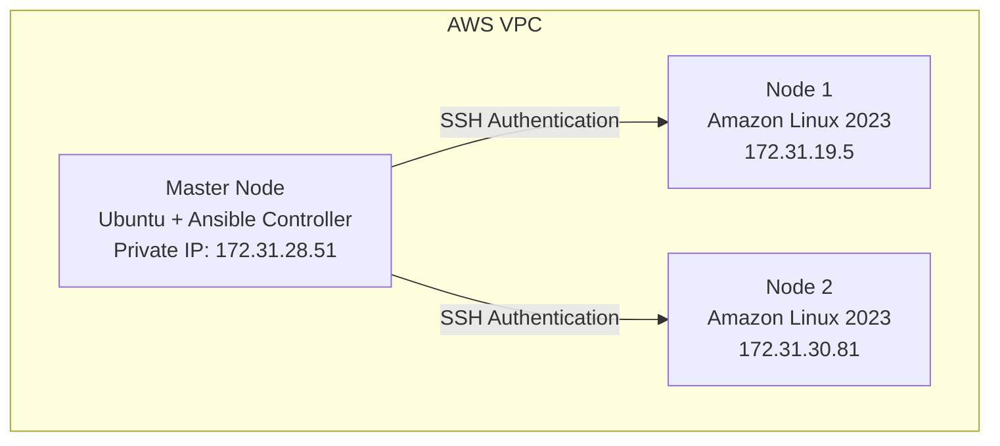
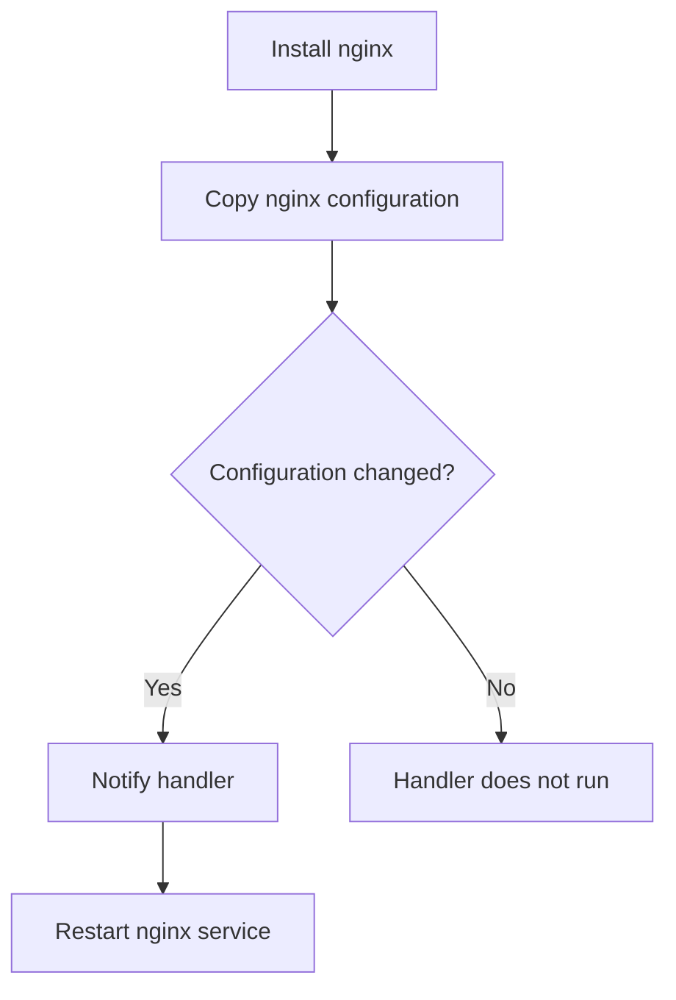

# Ansible Handlers Practice

## Project Phase: CloudForge — Multi-Node Infrastructure Automation Using Ansible on AWS

## Overview

In this phase, we implemented Ansible **Handlers** as part of an nginx configuration management workflow. The main goal was to understand how Ansible can automatically restart a service *only* when a configuration change actually occurs.

Without handlers, a playbook would restart a service on every single run, whether or not anything changed. With handlers, Ansible checks whether a change happened — and only triggers the restart when it did.

## Table of Contents

1. [Architecture](#1-architecture)
2. [Objective](#2-objective)
3. [What We Created](#3-what-we-created)
4. [Playbook Workflow](#4-playbook-workflow)
5. [Configuration File Deployment](#5-configuration-file-deployment)
6. [How the Handler Works](#6-how-the-handler-works)
7. [Handler Definition](#7-handler-definition)
8. [Execution Result](#8-execution-result)
9. [Achievements](#9-achievements)
10. [Problems Faced and Solutions](#10-problems-faced-and-solutions)
11. [Linux Knowledge Applied](#11-linux-knowledge-applied)
12. [Ansible Concepts Learned](#12-ansible-concepts-learned)
13. [Next Learning Step](#13-next-learning-step)

---

## 1. Architecture



## 2. Objective

- Install nginx automatically
- Deploy nginx configuration using Ansible
- Detect configuration changes
- Restart nginx only when required

## 3. What We Created

### Ansible Handler Playbook

**File:** `playbooks/nginx-handler.yml`

The playbook contains:

- Tasks
- A notification system (`notify`)
- A handler section

## 4. Playbook Workflow



## 5. Configuration File Deployment

The playbook deploys:

```
/etc/nginx/conf.d/ansible.conf
```

This file contains the nginx server configuration managed by Ansible:

```nginx
server {
    listen 80;

    location / {
        return 200 "Hello from Ansible Handler\n";
    }
}
```

## 6. How the Handler Works

The copy task uses:

```yaml
notify:
  - Restart nginx
```

This means: if this task changes the configuration file, call the handler.

**First execution:**

```
Configuration file created
        ↓
Status: changed
        ↓
Handler runs
        ↓
Nginx restarts
```

**Second execution:**

```
Configuration file already exists
        ↓
No change detected
        ↓
Handler does not run
```

This is Ansible's **idempotency** in action — running the same playbook twice doesn't repeat work that's already done.

## 7. Handler Definition

```yaml
handlers:
  - name: Restart nginx
    systemd:
      name: nginx
      state: restarted
```

**Purpose:** Restart the nginx service, but only after a configuration change.

## 8. Execution Result

**Command:**

```bash
ansible-playbook playbooks/nginx-handler.yml
```

**Result:**

```
TASK [Copy nginx configuration]
changed: [node1]
changed: [node2]

RUNNING HANDLER [Restart nginx]
changed: [node1]
changed: [node2]
```

## 9. Achievements

- [x] Created an Ansible handler workflow
- [x] Managed nginx configuration automatically
- [x] Used the `notify` mechanism
- [x] Restarted nginx only after configuration changes
- [x] Practiced service management using `systemd`
- [x] Improved understanding of Ansible idempotency

## 10. Problems Faced and Solutions

### Problem 1 — `Could not find the requested service nginx`

- **Cause:** The initial playbook used incorrect package/service management for Amazon Linux 2023.
- **Solution:** Changed `yum` → `dnf`, and `service` → `systemd`.

### Problem 2 — `sudo: a password is required`

- **Cause:** The `ubuntu` user could connect through SSH but didn't have passwordless sudo access.
- **Solution:** Created `/etc/sudoers.d/ubuntu` with `ubuntu ALL=(ALL) NOPASSWD: ALL`.

## 11. Linux Knowledge Applied

### Linux Service Management

`systemctl` — used to start nginx, restart nginx, and enable the service.

### Linux Configuration Files

Managed `/etc/nginx/conf.d/` — understanding service configuration and application settings.

### Linux Permissions

`chmod` and `chown` — used for managing file access.

### Package Management

`dnf` (Amazon Linux 2023) — used for installing nginx.

## 12. Ansible Concepts Learned

| Concept | Status |
|---|---|
| Playbook | Completed |
| Tasks | Completed |
| Modules | Completed |
| Variables | Completed |
| Handlers | Completed |
| Notify | Completed |
| Idempotency | Practiced |
| Systemd management | Completed |

## 13. Next Learning Step

- [ ] Loops
- [ ] Conditions
- [ ] Templates
- [ ] Roles
- [ ] Ansible Vault
