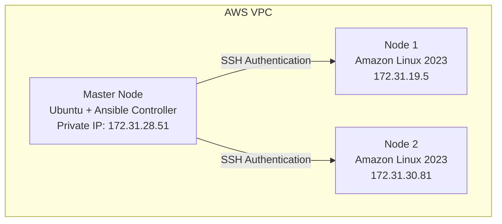
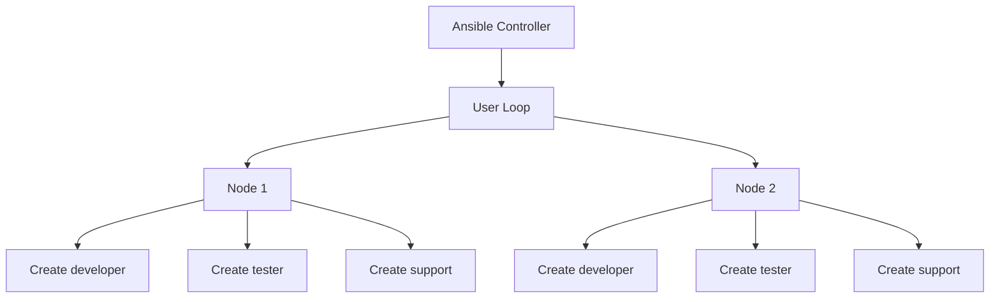

# Ansible Loops Practice Documentation

## Project: CloudForge — Multi-Node Infrastructure Automation Using Ansible on AWS

## Overview

In this phase, Ansible **Loops** were practiced to automate repetitive tasks across multiple managed nodes. The main purpose of a loop is to execute the same Ansible task multiple times with different values, instead of writing a separate task for each value.

## Table of Contents

1. [Architecture](#1-architecture)
2. [Objective](#2-objective)
3. [Loop Practice 1 — Package Installation](#3-loop-practice-1--package-installation)
4. [Loop Practice 2 — User Creation](#4-loop-practice-2--user-creation)
5. [How Loop Works](#5-how-loop-works)
6. [Execution Flow](#6-execution-flow)
7. [Understanding `changed` vs `ok`](#7-understanding-changed-vs-ok)
8. [Problems Faced and Solutions](#8-problems-faced-and-solutions)
9. [Linux Knowledge Applied](#9-linux-knowledge-applied)
10. [Ansible Concepts Learned](#10-ansible-concepts-learned)
11. [Achievements](#11-achievements)
12. [Next Learning Phase](#12-next-learning-phase)

---

## 1. Architecture



## 2. Objective

- Understand Ansible loop structure
- Use loops with different modules
- Automate package installation
- Automate Linux user creation
- Understand Ansible idempotency

## 3. Loop Practice 1 — Package Installation

**File:** `playbooks/loops.yml`

**Task:** Install multiple packages — `git`, `wget`, `vim`.

```yaml
loop:
  - git
  - wget
  - vim
```

**Command:**

```bash
ansible-playbook playbooks/loops.yml
```

**Result:**

```
node1 : ok=2 changed=0 failed=0
node2 : ok=2 changed=0 failed=0
```

**Explanation:** The packages were already installed on the servers, so Ansible checked their status and made no changes — demonstrating Ansible **idempotency**.

## 4. Loop Practice 2 — User Creation

**File:** `playbooks/user-loop.yml`

**Objective:** Create multiple Linux users — `developer`, `tester`, `support` — on all managed nodes.

**Command:**

```bash
ansible-playbook playbooks/user-loop.yml
```

**Output:**

```
changed: [node1] => (item=developer)
changed: [node2] => (item=developer)
changed: [node1] => (item=tester)
changed: [node2] => (item=tester)
changed: [node1] => (item=support)
changed: [node2] => (item=support)
```

**Final result:**

```
node1 : ok=2 changed=1 failed=0
node2 : ok=2 changed=1 failed=0
```

## 5. How Loop Works

**Without a loop**, creating three users would need three separate tasks — one for `developer`, one for `tester`, one for `support`.

**With a loop**, one task handles all three:

```yaml
- name: Create users
  user:
    name: "{{ item }}"
  loop:
    - developer
    - tester
    - support
```

Ansible repeats the same task automatically, once per item in the list.

## 6. Execution Flow



## 7. Understanding `changed` vs `ok`

**`changed`:**

```
changed: [node1] => (item=developer)
```

Ansible modified the server — the user didn't exist before, so Ansible created it.

**`ok`:**

```
ok: [node1] => (item=git)
```

The required state already existed, so no modification was needed.

## 8. Problems Faced and Solutions

### Problem 1 — Understanding loop execution

- **Confusion:** The same task appeared multiple times in the output — `(item=developer)`, `(item=tester)`, `(item=support)`.
- **Solution:** Each line represents one value from the loop list — `item` takes on `developer`, then `tester`, then `support` in turn.

### Problem 2 — Understanding `changed` and `ok` status

- **Confusion:** Unclear what distinguishes a `changed` result from an `ok` result in loop output.
- **Solution:** `changed` means Ansible made a modification (e.g. the user didn't exist yet); `ok` means the desired state was already true and nothing needed to change.

## 9. Linux Knowledge Applied

### Linux User Management

Created users `developer`, `tester`, and `support`, backed by `/etc/passwd`.

```bash
useradd
cat /etc/passwd
```

### Package Management

Used the Amazon Linux package manager, `dnf`, to install `git`, `wget`, and `vim`.

### Remote Server Administration

Managed both Node 1 and Node 2 from a single Ansible controller.

## 10. Ansible Concepts Learned

| Concept | Status |
|---|---|
| Inventory | Completed |
| SSH Authentication | Completed |
| Ad-hoc Commands | Completed |
| Playbooks | Completed |
| Variables | Completed |
| Handlers | Completed |
| Loops | Completed |
| Idempotency | Practiced |

## 11. Achievements

- [x] Created loop-based Ansible automation
- [x] Installed multiple packages using loops
- [x] Created multiple Linux users using loops
- [x] Managed two AWS EC2 nodes from one controller
- [x] Learned `item` variable usage
- [x] Understood `changed` vs `ok` status
- [x] Practiced repeatable infrastructure automation

## 12. Next Learning Phase

- [ ] Conditions (`when`)
- [ ] Templates (Jinja2)
- [ ] Roles
- [ ] Ansible Vault
- [ ] Complete infrastructure automation project
