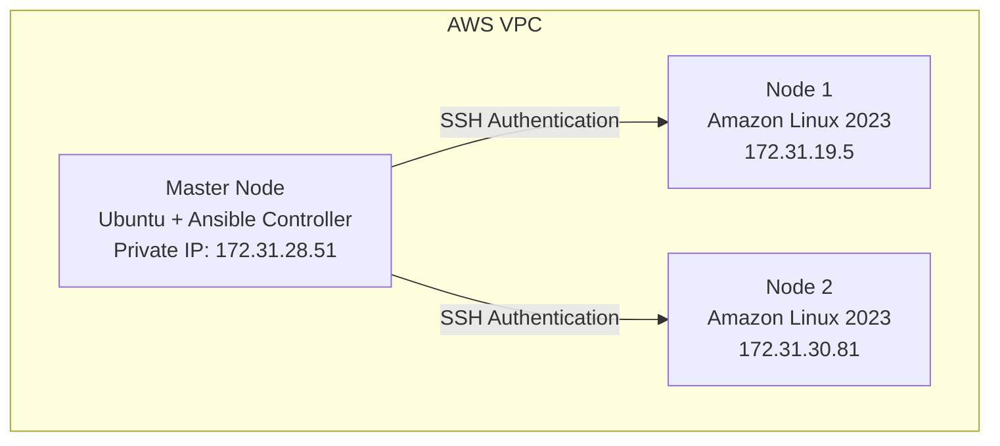
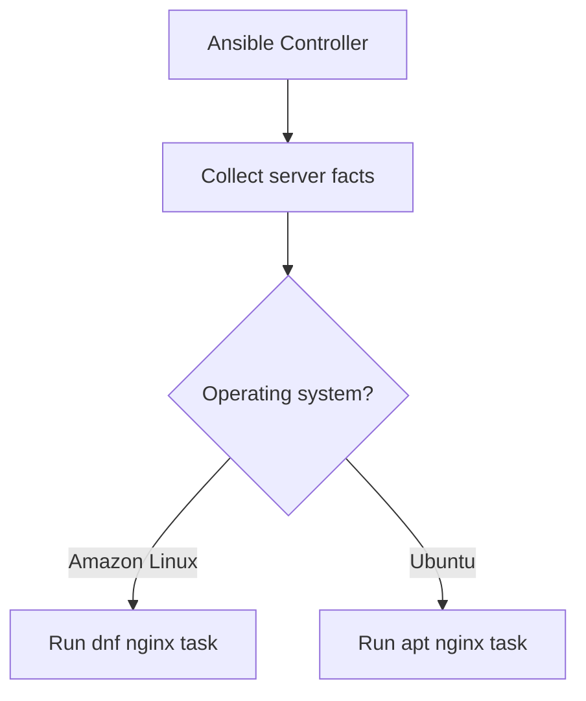

# Ansible Conditions (`when`) Documentation

## Project: CloudForge — Multi-Node Infrastructure Automation Using Ansible on AWS

## Overview

In this phase, Ansible **Conditions** were practiced using the `when` statement. Conditions allow Ansible to run a task only when a specific requirement is true — instead of running every task on every server, Ansible checks server information and decides whether a task should execute or skip.

## Table of Contents

1. [Architecture](#1-architecture)
2. [Objective](#2-objective)
3. [What Is an Ansible Condition?](#3-what-is-an-ansible-condition)
4. [Playbook Created](#4-playbook-created)
5. [Condition Examples](#5-condition-examples)
6. [Execution Flow](#6-execution-flow)
7. [Problem Faced and Solution](#7-problem-faced-and-solution)
8. [Execution Result](#8-execution-result)
9. [Understanding Status](#9-understanding-status)
10. [Ansible Facts Used](#10-ansible-facts-used)
11. [Linux Knowledge Applied](#11-linux-knowledge-applied)
12. [Ansible Concepts Learned](#12-ansible-concepts-learned)
13. [Achievements](#13-achievements)
14. [Next Learning Phase](#14-next-learning-phase)

---

## 1. Architecture



## 2. Objective

- Understand Ansible conditional execution
- Use Ansible facts
- Run tasks based on operating system
- Understand skipped tasks
- Practice OS-based automation

## 3. What Is an Ansible Condition?

A condition controls whether a task should run:

```yaml
when: condition
```

If the condition is true, the task executes. If it's false, the task is skipped.

## 4. Playbook Created

**File:** `playbooks/conditions.yml`

**Check the operating system:**

```yaml
- name: Show operating system
  debug:
    msg: "This server is {{ ansible_distribution }}"
```

**Purpose:** Display the operating system information collected by Ansible facts.

## 5. Condition Examples

**Install nginx on Amazon Linux only:**

```yaml
- name: Install nginx on Amazon Linux only
  dnf:
    name: nginx
    state: present
  when: ansible_facts['distribution'] == "Amazon"
```

**Install nginx on Ubuntu only:**

```yaml
- name: Install nginx on Ubuntu only
  apt:
    name: nginx
    state: present
  when: ansible_facts['distribution'] == "Ubuntu"
```

Each task only runs if the managed node's detected distribution matches.

## 6. Execution Flow



## 7. Problem Faced and Solution

### Problem — Condition was skipping unexpectedly

**Initial condition:**

```yaml
when: ansible_distribution == "Amazon Linux"
```

**Result:**

```
skipping: [node1]
skipping: [node2]
```

**Cause:** The actual Ansible fact value was `Amazon`, not `Amazon Linux`. The debug task showed `This server is Amazon` — the condition didn't match the actual fact value.

**Solution:** Updated the condition:

```yaml
# Before
when: ansible_distribution == "Amazon Linux"

# After
when: ansible_facts['distribution'] == "Amazon"
```

## 8. Execution Result

**Command:**

```bash
ansible-playbook playbooks/conditions.yml
```

**Result:**

```
TASK [Show operating system]
ok: [node1]
ok: [node2]

TASK [Install nginx on Amazon Linux only]
ok: [node1]
ok: [node2]

TASK [Install nginx on Ubuntu only]
skipping: [node1]
skipping: [node2]
```

## 9. Understanding Status

| Status | Meaning |
|---|---|
| `ok` | Task executed successfully; no changes were required |
| `changed` | Ansible modified the server |
| `skipping` | The condition was false; the task was not executed |

## 10. Ansible Facts Used

```yaml
ansible_facts['distribution']
```

**Value:** `Amazon`

Facts allow Ansible to make decisions based on real server information rather than assumptions.

## 11. Linux Knowledge Applied

### Operating System Detection

Checked the Linux distribution and general server information.

### Package Management

Used different package managers depending on the OS: `dnf` for Amazon Linux, `apt` for Ubuntu.

### Configuration Management

Built one playbook that can support different Linux distributions.

## 12. Ansible Concepts Learned

| Concept | Status |
|---|---|
| Inventory | Completed |
| SSH Authentication | Completed |
| Ad-hoc Commands | Completed |
| Playbooks | Completed |
| Variables | Completed |
| Handlers | Completed |
| Loops | Completed |
| Roles | Completed |
| Conditions (`when`) | Completed |

## 13. Achievements

- [x] Created a condition-based playbook
- [x] Used Ansible facts
- [x] Applied OS-based task execution
- [x] Learned task-skipping behavior
- [x] Solved a condition mismatch issue
- [x] Created flexible automation for multiple Linux distributions

## 14. Next Learning Phase

- [ ] Templates (Jinja2)
- [ ] Ansible Vault
- [ ] Tags
- [ ] Error handling
- [ ] Complete infrastructure automation project
