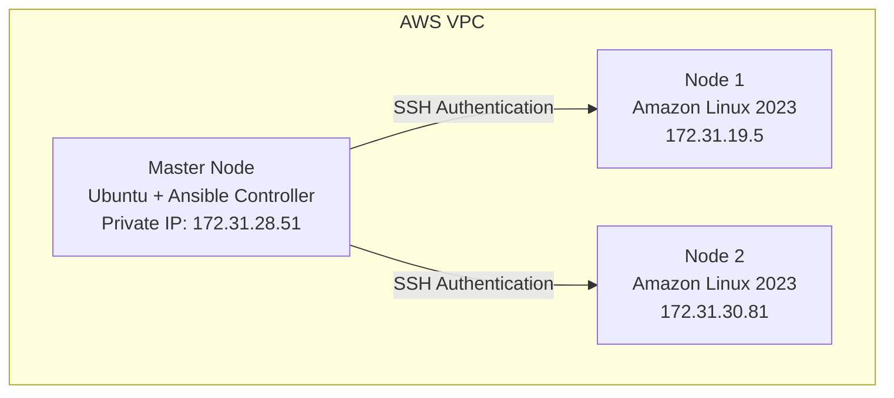

# Ansible Roles Documentation

## Project: CloudForge — Multi-Node Infrastructure Automation Using Ansible on AWS

## Overview

In this phase, Ansible **Roles** were introduced to organize automation code into a reusable structure. Before roles, all tasks were written directly inside playbooks — as automation grows, managing large playbooks like that becomes difficult.

Roles separate different parts of automation into dedicated folders — tasks, handlers, variables, templates, files — making the project easier to maintain and reuse.

## Table of Contents

1. [Architecture](#1-architecture)
2. [Objective](#2-objective)
3. [Why We Use Roles](#3-why-we-use-roles)
4. [Role Structure Created](#4-role-structure-created)
5. [Task File](#5-task-file)
6. [Handler File](#6-handler-file)
7. [Default Variables](#7-default-variables)
8. [Main Playbook](#8-main-playbook)
9. [Problem Faced and Solution](#9-problem-faced-and-solution)
10. [Verification](#10-verification)
11. [Execution](#11-execution)
12. [Final Result](#12-final-result)
13. [Achievements](#13-achievements)
14. [Linux Knowledge Applied](#14-linux-knowledge-applied)
15. [Ansible Concepts Completed](#15-ansible-concepts-completed)
16. [Next Learning Phase](#16-next-learning-phase)

---

## 1. Architecture



## 2. Objective

- Understand Ansible role structure
- Create a reusable nginx role
- Connect a playbook with a role
- Configure the Ansible role path
- Execute automation using roles

## 3. Why We Use Roles

**Before roles**, each playbook contained tasks directly:

```
playbooks/
  install-nginx.yml
  system-setup.yml
  nginx-handler.yml
```

For large projects this creates large YAML files, difficult maintenance, and duplicate code.

**After roles**, automation becomes reusable:

```
roles/
  nginx/
    ├── tasks
    ├── handlers
    └── defaults
```

## 4. Role Structure Created

**Created:** `roles/nginx/`

```
roles
└── nginx
    ├── tasks
    │   └── main.yml
    ├── handlers
    │   └── main.yml
    └── defaults
        └── main.yml
```

## 5. Task File

**Location:** `roles/nginx/tasks/main.yml`

**Purpose:** Contains the main actions performed by the role.

**Install nginx:**

```yaml
- name: Install nginx package
  dnf:
    name: nginx
    state: present
```

**Start nginx service:**

```yaml
- name: Start nginx service
  systemd:
    name: nginx
    state: started
    enabled: yes
```

## 6. Handler File

**Location:** `roles/nginx/handlers/main.yml`

**Purpose:** Contains actions triggered by notifications.

```yaml
- name: Restart nginx
  systemd:
    name: nginx
    state: restarted
```

## 7. Default Variables

**Location:** `roles/nginx/defaults/main.yml`

**Purpose:** Stores default values used by the role.

```yaml
nginx_package: nginx
```

## 8. Main Playbook

**Created:** `playbooks/site.yml`

```yaml
---
- name: Configure nginx using role
  hosts: nodes
  become: yes

  roles:
    - nginx
```

The playbook only calls the role — the role itself contains the actual automation logic.

## 9. Problem Faced and Solution

### Problem — `the role 'nginx' was not found`

**Cause:** Ansible didn't know where the roles directory was located. The project structure was:

```
ansible-project/
├── playbooks/
└── roles/
    └── nginx
```

but Ansible was searching its default role locations instead.

**Solution:** Updated `ansible.cfg`:

```ini
[defaults]
inventory = inventory
remote_user = ubuntu
host_key_checking = False
roles_path = ./roles
```

## 10. Verification

**Command:**

```bash
ansible-config dump | grep DEFAULT_ROLES_PATH
```

**Output:**

```
DEFAULT_ROLES_PATH = ['/home/ubuntu/ansible-project/roles']
```

## 11. Execution

**Syntax check:**

```bash
ansible-playbook playbooks/site.yml --syntax-check
```

```
playbook: playbooks/site.yml
```

**Run the role:**

```bash
ansible-playbook playbooks/site.yml
```

```
TASK [nginx : Install nginx package]
ok: [node1]
ok: [node2]

TASK [nginx : Start nginx service]
ok: [node1]
ok: [node2]
```

## 12. Final Result

```
node1:
ok=3
changed=0
failed=0

node2:
ok=3
changed=0
failed=0
```

The nginx role executed successfully on both managed nodes.

## 13. Achievements

- [x] Created first Ansible role
- [x] Created role directory structure
- [x] Created task file
- [x] Created handler file
- [x] Created default variable file
- [x] Connected role with playbook
- [x] Configured `roles_path`
- [x] Executed role successfully on multiple EC2 nodes

## 14. Linux Knowledge Applied

### Service Management

`systemctl` — managed the nginx service and its state.

### Package Management

`dnf` (Amazon Linux 2023) — used for nginx installation.

### Configuration Management

Managed server configuration through Ansible automation instead of manual SSH commands.

## 15. Ansible Concepts Completed

| Concept | Status |
|---|---|
| Inventory | Completed |
| SSH Authentication | Completed |
| Ad-hoc Commands | Completed |
| Playbooks | Completed |
| Variables | Completed |
| Handlers | Completed |
| Loops | Completed |
| Roles | Completed |

## 16. Next Learning Phase

- [ ] Conditions (`when`)
- [ ] Templates (Jinja2)
- [ ] Ansible Vault
- [ ] Complete infrastructure automation project
