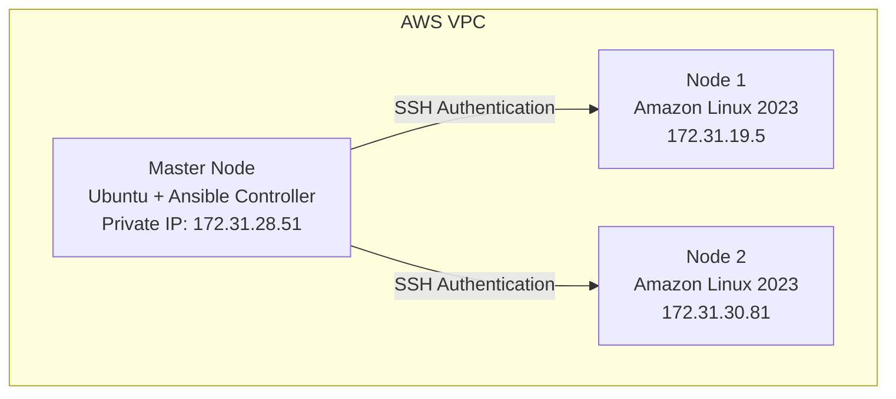

# Ansible Vault Documentation

## Project: CloudForge — Multi-Node Infrastructure Automation Using Ansible on AWS

## Overview

In this phase, **Ansible Vault** was implemented to protect sensitive information inside the Ansible project. Information such as passwords, API keys, database credentials, and secret tokens shouldn't be stored as plain text, since anyone with repository access could read them.

Ansible Vault encrypts these variables and only allows access with the Vault password.

## Table of Contents

1. [Architecture](#1-architecture)
2. [Objective](#2-objective)
3. [Why Ansible Vault?](#3-why-ansible-vault)
4. [Vault File Structure](#4-vault-file-structure)
5. [Secret Variables Created](#5-secret-variables-created)
6. [Encrypting the File](#6-encrypting-the-file)
7. [Viewing Encrypted Data](#7-viewing-encrypted-data)
8. [Playbook Created](#8-playbook-created)
9. [Problem Faced and Solution](#9-problem-faced-and-solution)
10. [Testing Vault Security](#10-testing-vault-security)
11. [Important Vault Commands](#11-important-vault-commands)
12. [Linux and DevOps Knowledge Applied](#12-linux-and-devops-knowledge-applied)
13. [Ansible Concepts Completed](#13-ansible-concepts-completed)
14. [Achievements](#14-achievements)
15. [Next Learning Phase](#15-next-learning-phase)

---

## 1. Architecture



## 2. Objective

- Understand the purpose of Ansible Vault
- Encrypt sensitive variables
- Use encrypted variables inside playbooks
- Learn the core Vault commands
- Test secret access with and without the Vault password

## 3. Why Ansible Vault?

**Without Vault**, secrets sit in plain text — anyone with repository access can read them:

```yaml
db_password: MyPassword123
api_key: ABC123XYZ
```

**With Vault**, the file is encrypted and only readable with the correct password:


The actual values remain protected at rest.

## 4. Vault File Structure

**Created:** `group_vars/nodes/vault.yml`

```
group_vars/
└── nodes/
    └── vault.yml
```

The folder name matches the inventory group:

```ini
[nodes]
node1
node2
```

Ansible automatically loads variables from `group_vars/nodes/` for the `nodes` group.

## 5. Secret Variables Created

```yaml
db_password: MySecretPassword123
api_key: ABC123XYZ789
admin_password: Admin@123
```

These values were encrypted using Ansible Vault.

## 6. Encrypting the File

**Command:**

```bash
ansible-vault encrypt group_vars/nodes/vault.yml
```

After encryption, the file content changed from readable YAML to:

```
$ANSIBLE_VAULT;1.1;AES256
encrypted-data
```

The real values were no longer visible in the file.

## 7. Viewing Encrypted Data

**Command:**

```bash
ansible-vault view group_vars/nodes/vault.yml
```

Ansible prompts for `Vault password:`. After entering the correct password, the plain values are displayed:

```yaml
db_password: MySecretPassword123
api_key: ABC123XYZ789
admin_password: Admin@123
```

## 8. Playbook Created

**File:** `playbooks/vault-test.yml`

```yaml
---
- name: Test Ansible Vault
  hosts: nodes
  become: yes

  tasks:
    - name: Show secret message
      debug:
        msg: "Database password is {{ db_password }}"
```

## 9. Problem Faced and Solution

### Problem — `'db_password' is undefined`

**Cause:** The Vault file location was incorrect. The initial structure was:

```
group_vars/
└── vault.yml
```

which meant Ansible couldn't automatically load the variable for the `nodes` inventory group.

**Solution:** Moved the file under a group-named folder:

```
group_vars/
└── nodes/
    └── vault.yml
```

Now Ansible loads the variables automatically for the `nodes` group.

## 10. Testing Vault Security

| Test | Command | Result |
|---|---|---|
| Direct file check | `cat group_vars/nodes/vault.yml` | Shows `$ANSIBLE_VAULT;1.1;AES256` — secret values hidden |
| View with password | `ansible-vault view group_vars/nodes/vault.yml` | Prompts for password, then displays secrets |
| Run playbook without password | `ansible-playbook playbooks/vault-test.yml` | Fails — `Vault password required` |
| Run playbook with password | `ansible-playbook playbooks/vault-test.yml --ask-vault-pass` | Succeeds — decrypts and shows the secret message |

**Successful run output:**

```
TASK [Show secret message]
ok: [node1]
ok: [node2]
```

```json
{
  "msg": "Database password is MySecretPassword123"
}
```

## 11. Important Vault Commands

```bash
# Encrypt a file
ansible-vault encrypt file.yml

# View an encrypted file
ansible-vault view file.yml

# Edit an encrypted file
ansible-vault edit file.yml

# Change the Vault password
ansible-vault rekey file.yml
```

## 12. Linux and DevOps Knowledge Applied

### Security Management

Protected database passwords, API keys, and other secret variables.

### Configuration Management

Used encrypted variables inside Ansible automation.

### Access Control

Only users with the Vault password can decrypt sensitive information.

## 13. Ansible Concepts Completed

| Concept | Status |
|---|---|
| Inventory | Completed |
| SSH Authentication | Completed |
| Ad-hoc Commands | Completed |
| Playbooks | Completed |
| Variables | Completed |
| Handlers | Completed |
| Loops | Completed |
| Roles | Completed |
| Conditions | Completed |
| Ansible Vault | Completed |

## 14. Achievements

- [x] Created encrypted variable storage
- [x] Protected sensitive information
- [x] Integrated Vault variables with playbooks
- [x] Solved a variable-loading issue
- [x] Tested Vault access control
- [x] Learned secure secret management in Ansible

## 15. Next Learning Phase

- [ ] Templates (Jinja2)
- [ ] Tags
- [ ] Error handling
- [ ] Complete infrastructure automation project
