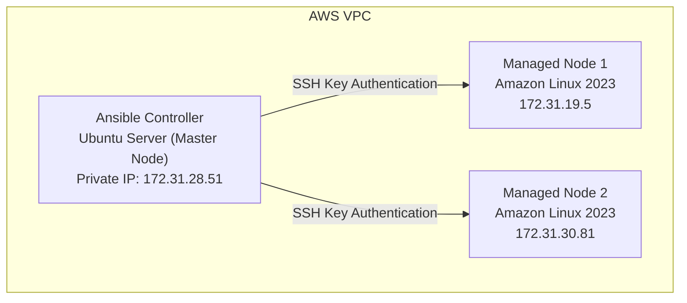
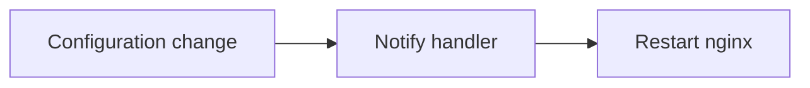

# CloudForge: Multi-Node Infrastructure Automation Using Ansible on AWS

## Project Overview

**CloudForge** is a DevOps automation project that demonstrates how to manage and configure multiple cloud servers using Ansible on AWS EC2 infrastructure.

The project builds a multi-node environment where one Ansible Controller node manages multiple remote servers through secure, SSH-based communication. The main goal is to replace repetitive manual server management with automated, repeatable, and scalable infrastructure configuration.

## Table of Contents

1. [Project Architecture](#1-project-architecture)
2. [Project Components](#2-project-components)
3. [Project Objectives](#3-project-objectives)
4. [Technologies Used](#4-technologies-used)
5. [Implementation Journey](#5-implementation-journey)
6. [Automation Features Implemented](#6-automation-features-implemented)
7. [Current Project Structure](#7-current-project-structure)
8. [Problems Solved During Development](#8-problems-solved-during-development)
9. [Skills Developed](#9-skills-developed)
10. [Documentation Index](#10-documentation-index)
11. [Future Expansion](#11-future-expansion)
12. [Project Status](#12-project-status)

---

## 1. Project Architecture



## 2. Project Components

### Ansible Controller Node

Responsible for running Ansible commands and managing remote servers:

- Execute Ansible playbooks
- Manage inventory
- Store automation code
- Connect with managed nodes through SSH

**Operating System:** Ubuntu

### Managed Nodes

Remote servers controlled by Ansible:

- Receive automation tasks
- Install packages
- Configure services
- Apply system changes

**Operating System:** Amazon Linux 2023

## 3. Project Objectives

- Build AWS-based multi-node infrastructure
- Configure passwordless SSH authentication
- Learn the Ansible automation workflow
- Automate server configuration
- Create reusable automation using roles
- Secure sensitive data using Ansible Vault
- Develop production-style DevOps practices

## 4. Technologies Used

| Category | Technology | Used For |
|---|---|---|
| Cloud platform | AWS EC2 | Controller server, managed servers, private network communication |
| Automation tool | Ansible | Configuration management, software installation, service management |
| Operating systems | Ubuntu, Amazon Linux 2023 | Controller and managed-node operating systems |

## 5. Implementation Journey

### Phase 1 — AWS Infrastructure Setup

- Created EC2 instances
- Configured security groups
- Verified private IP communication

### Phase 2 — SSH Passwordless Authentication

- SSH key generation
- Public key distribution
- `authorized_keys` configuration
- SSH access without a password

**Purpose:** Ansible requires secure SSH communication with managed nodes.

### Phase 3 — Ansible Configuration

**Created:** `ansible.cfg`, `inventory`

**Configured:** inventory location, remote user, host key checking, role path

### Phase 4 — Ansible Connectivity Testing

```bash
ansible nodes -m ping
```

```
node1 SUCCESS
node2 SUCCESS
```

## 6. Automation Features Implemented

### Ad-hoc Commands

Server uptime, hostname, disk usage, and network information checks, e.g.:

```bash
ansible nodes -a "uptime"
```

### Playbooks

Created for package installation, system configuration, and nginx deployment.

### Variables

Used to avoid repeating values inside playbooks.

### Handlers

Implemented service-restart automation, triggered only on configuration change:



### Loops

Automated repetitive tasks — installing multiple packages, creating multiple users.

### Roles

Created a reusable nginx role:

```
roles/
└── nginx
    ├── tasks
    ├── handlers
    └── defaults
```

### Conditions

Implemented decision-based automation with `when:` — e.g. installing nginx on Amazon Linux while skipping Ubuntu-specific tasks.

### Ansible Vault

Implemented secure secret management, protecting passwords, API keys, and other sensitive variables.

## 7. Current Project Structure

```
ansible-project/
├── ansible.cfg
├── inventory
│
├── group_vars/
│   └── nodes/
│       └── vault.yml
│
├── playbooks/
│   ├── install-nginx.yml
│   ├── system-setup.yml
│   ├── nginx-handler.yml
│   ├── loops.yml
│   ├── user-loop.yml
│   ├── conditions.yml
│   ├── site.yml
│   └── vault-test.yml
│
├── roles/
│   └── nginx/
│       ├── tasks/
│       ├── handlers/
│       └── defaults/
│
└── docs/
```

## 8. Problems Solved During Development

| Problem | Solution |
|---|---|
| `Permission denied (publickey)` | Corrected SSH key configuration, updated permissions, configured `authorized_keys` |
| `sudo: a password is required` | Configured passwordless sudo: `ubuntu ALL=(ALL) NOPASSWD: ALL` |
| `role 'nginx' was not found` | Added `roles_path = ./roles` inside `ansible.cfg` |
| `db_password is undefined` | Moved Vault variables into `group_vars/nodes/vault.yml` |

## 9. Skills Developed

- AWS EC2 administration
- Linux server management
- SSH security
- Ansible automation
- YAML configuration
- Infrastructure as Code concepts
- Service management
- Secure secret handling
- Reusable automation design

## 10. Documentation Index

| # | Topic | File |
|---|---|---|
| 1 | Infrastructure & Ansible setup | `01-infrastructure-and-ansible-setup.md` |
| 2 | Ad-hoc commands | `02-ansible-ad-hoc-commands.md` |
| 3 | Automation summary (playbooks 1 & 2) | `03-ansible-automation-summary.md` |
| 6 | Handlers | `06-ansible-handlers.md` |
| 7 | Loops | `07-ansible-loops.md` |
| 8 | Roles | `08-ansible-roles.md` |
| 9 | Conditions (`when`) | `09-ansible-conditions.md` |
| 10 | Ansible Vault | `10-ansible-vault.md` |

> File paths above are relative to wherever each doc actually lives in the repo (root or `docs/`) — adjust the links if you standardize the folder later.

## 11. Future Expansion

- Docker installation automation
- Application deployment
- Load balancer configuration
- Monitoring setup
- CI/CD pipeline integration
- Complete production-style infrastructure automation

## 12. Project Status

| Area | Status |
|---|---|
| AWS Infrastructure | ✅ Completed |
| SSH Authentication | ✅ Completed |
| Inventory Management | ✅ Completed |
| Ad-hoc Commands | ✅ Completed |
| Playbooks | ✅ Completed |
| Variables | ✅ Completed |
| Handlers | ✅ Completed |
| Loops | ✅ Completed |
| Roles | ✅ Completed |
| Conditions | ✅ Completed |
| Ansible Vault | ✅ Completed |
